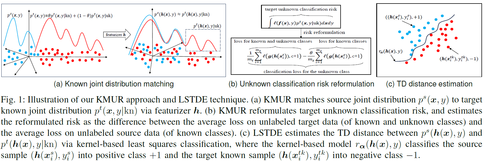

# Known-Joint-Distribution-Matching-and-Unknown-Classification-Risk-Reformulation (KMUR)

This repository provides the PyTorch code for the work "Open Set Domain Adaptation via Known Joint Distribution Matching and Unknown Classification Risk Reformulation" published in IEEE Transactions on Neural Networks and Learning Systems, 2026. This work includes (1) matching the source joint distribution to the target known joint distribution under the Triangular Discrimination (TD) distance, and (2) deriving the unknown classification loss for recognizing the unknown class. See Fig.1 for the illustration of the main ideas and Fig.2 for the neural network architecture. 

For quick demonstration, in this repository, the network model is implemented as a one-hidden-layer neural network, and the dataset for evaluating the KMUR approach is the PIE-Multiview dataset (see dataset description in the paper). The video for introducing this work will soon be available at the Bilibili website.

Besides the KMUR approach for open set domain adaptation, we also develop a technique named Least Squares Triangular Discrimination Estimation (LSTDE) to estimate the Triangular Discrimination (TD) distance from empirical data. The TD distance is a statistical distance for measuring the discrepancy between two probability distributions. Our technique casts the estimation into the kernel-based least squares classification problem that has an analytic solution. See Fig.3 for the demonstration of the LSTDE technique on synthetic data.

For details of this open set domain adaptation work,  please refer to the paper below: 

@article{Chen2026Open,  
  author={Sentao Chen and Ping Xuan and Lifang He},  
  journal={IEEE Transactions on Neural Networks and Learning Systems},   
  title={Open Set Domain Adaptation via Known Joint Distribution Matching and Unknown Classification Risk Reformulation},   
  year={2026},   
  volume = {},  
  pages={},   
  issn = {},  
  doi={https://doi.org/10.1109/TNNLS.2025.3647483}   
  }

